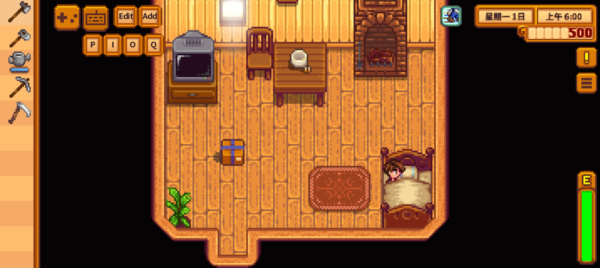
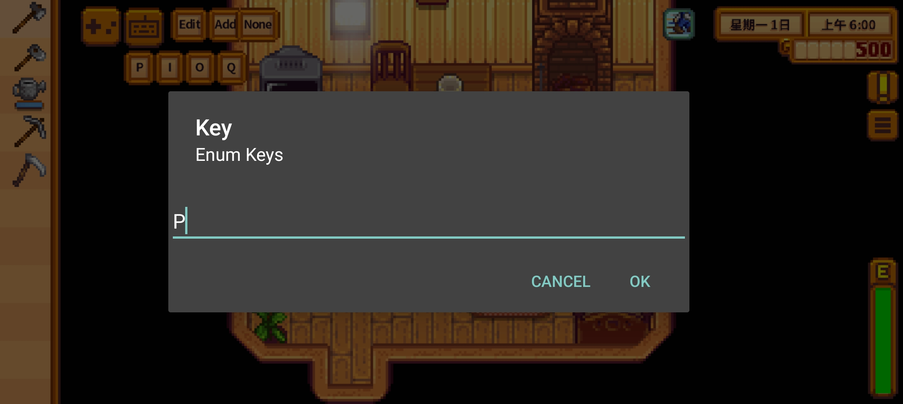
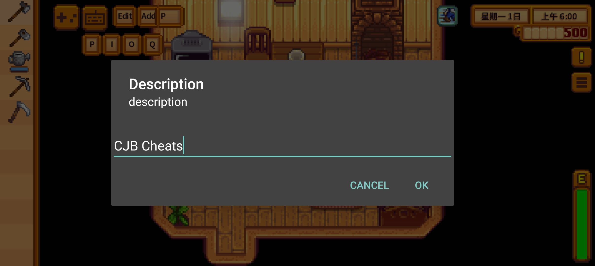
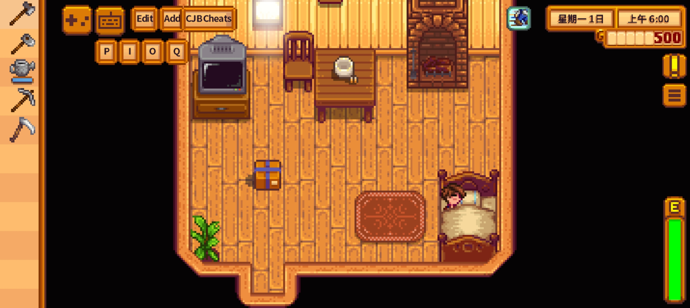
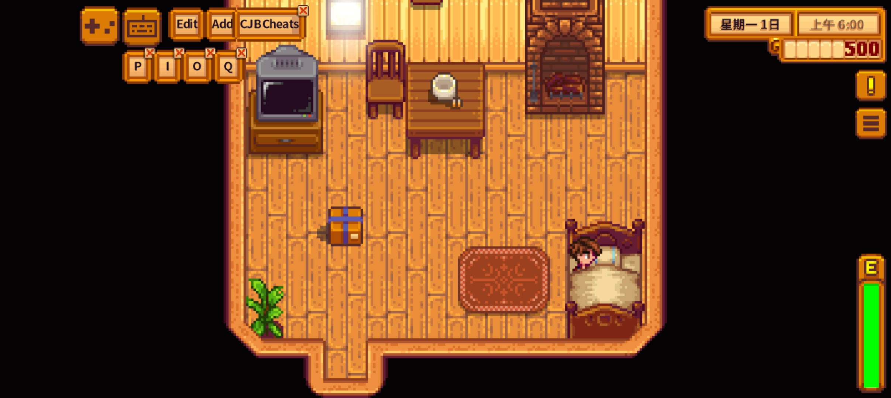
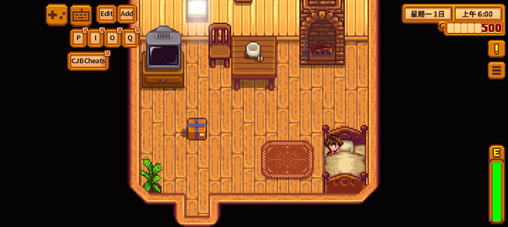
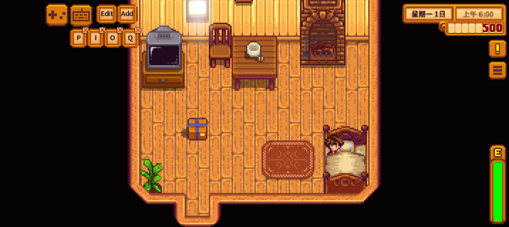

# VirtualKeyboard

Stardew Valley mod that add simple virtual keyboard

## Install

### PC User

1. Install the latest version of [SMAPI](https://smapi.io/).
2. Download this mod and unzip it into Stardew Valley/Mods.
3. Run the game using SMAPI.

### Android User

1. Install the latest version of [SMAPILoader](https://github.com/NRTnarathip/SMAPILoader).
2. Download this mod.
3. Unzip it into Android\data\abc.smapi.gameloader\files\Mods or Use SMAPILauncher -> Mod Manager -> install Mod and select mod zip
4. SMAPILauncher -> Start Game

## How to use

**[warn] If you're upgrading from an older version, please delete the old config.json file first.**

A simple virtual keyboard that supports multiple keys and shows on screen.

Press the toggle button on screen to show the keyboard; press it again to hide it.

The config.json file is automatically generated after the first run with the mod.

### Add Button

To add a new button:

1. Click the **Add** button.
2. Enter the new button's **Enum Key** and **description**. (All valid Enum Keys can be found in the [official MonoGame documentation](https://docs.monogame.net/api/Microsoft.Xna.Framework.Input.Keys.html).)
3. The new custom button will then appear next to the **Add** button.






### Move Button

To move a button:

1. Click the **Edit** button to enter edit mode. A small **×**(cross) icon will appear in the top-right corner of each button.

2. Click and hold the button you wish to move, then **drag** it to the desired position.






### Delete Button

To delete a button:

1. Click the **Edit** button to enter edit mode. A small **×**(cross) icon will appear in the top-right corner of each button.

2. Simply click the **×** icon on the button you wish to remove.




### Resize Button

To resize buttons:

1. Open the `config.json` file.
2. Locate and modify the value of the `ButtonScale` setting. The default value is 1.0.

```json
  "ButtonScale": 1.0
```

### Set Display Layer

To set button display layer (above or below game UI):

1. Open the `config.json` file.
2. Locate and modify the value of the `AboveMenu` setting:
   - **0:** Game UI will cover the buttons. (Default)
   - **1:** Buttons will be displayed on top of the game UI.

```json
  "AboveMenu": 0
```

### Change Toggle Image

To change the toggle button image:

1. Add your own image file to the `assets` directory.
2. Open the `config.json` file.
3. Locate and modify the value of the `TogglePath` setting. Set it to the path of your new image file (e.g., `"assets/your_image.png"`). The default value is `"assets/togglebutton.png"`.

```json
  "TogglePath": "assets/togglebutton.png"
```

### Default Config

Default config.json may like this:

```json
{
  "AboveMenu": 0,
  "ButtonScale": 1.0,
  "TriggerPath": "assets/togglebutton.png",
  "vToggle": {
    "key": "None",
    "rectangle": {
      "X": 36,
      "Y": 12,
      "Width": 64,
      "Height": 64
    }
  },
  "Buttons": [
    {
      "key": "P",
      "alias": "",
      "pos": {
        "X": 48,
        "Y": 92
      }
    },
    {
      "key": "I",
      "alias": "",
      "pos": {
        "X": 96,
        "Y": 92
      }
    },
    {
      "key": "O",
      "alias": "",
      "pos": {
        "X": 143,
        "Y": 92
      }
    },
    {
      "key": "Q",
      "alias": "",
      "pos": {
        "X": 193,
        "Y": 92
      }
    }
  ],
  "Init": true
}
```

## Compatibility

- Work with [SMAPI](https://smapi.io/) 4.1.10 with Stardew Valley 1.6.15 on Windows, other version not test.
- Work with [SMAPILoader](https://github.com/NRTnarathip/SMAPILoader) 1.1.4 with Stardew Valley 1.6.15 on Android
